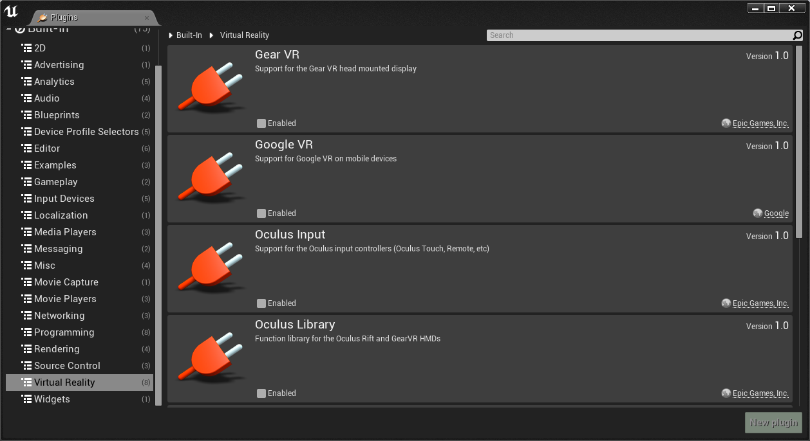
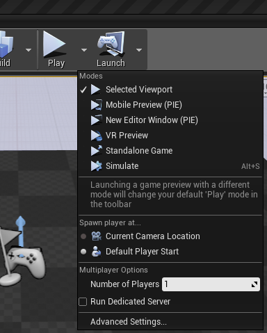
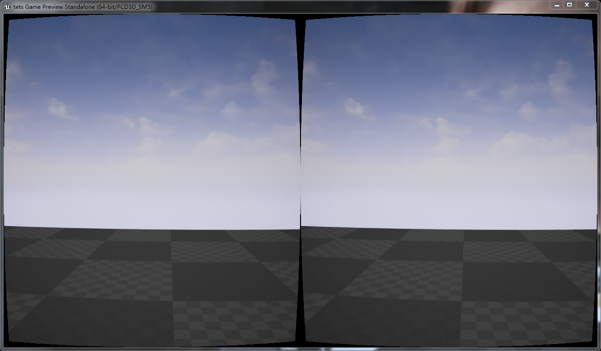
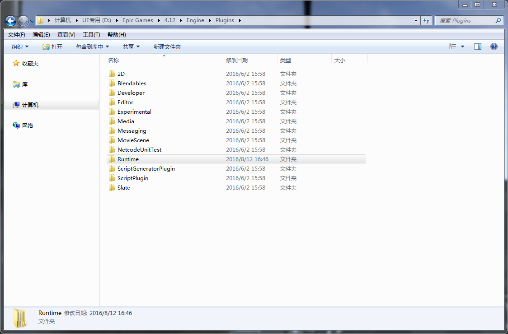
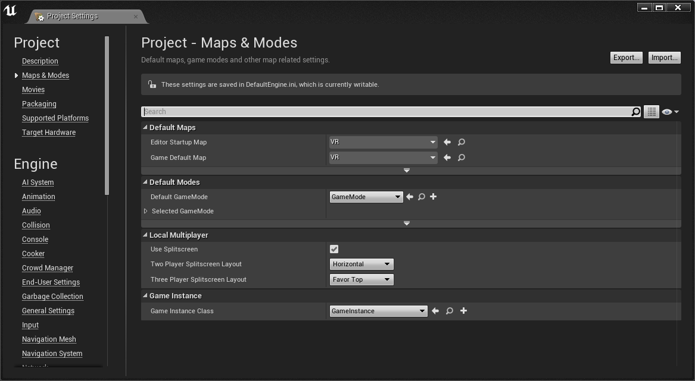
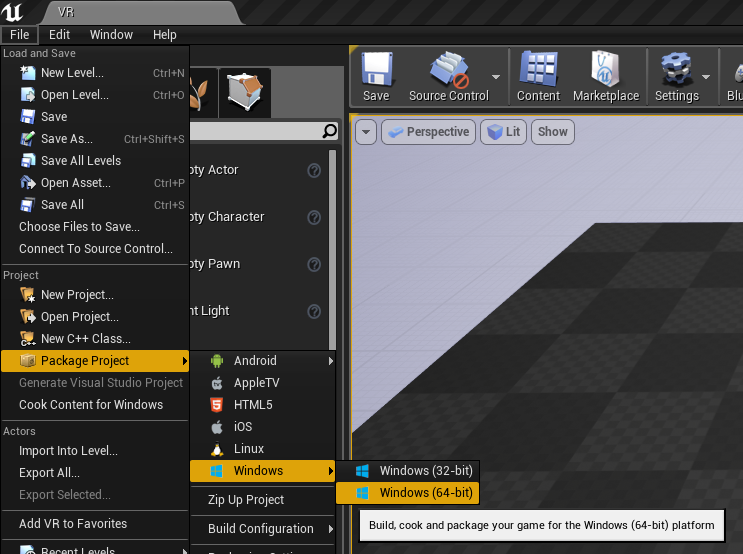
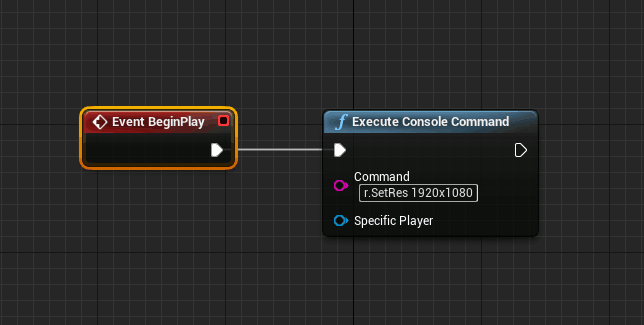

#Immersion API Index#

----------
## Download: 

 [**Unreal-SDK-4_12.rar**](attachment/unreal/4_12/IVR.rar)  
 [**Unreal-SDK-4_13.rar**](attachment/unreal/4_13/IVR.rar) 

## 参数列表(Command Argument List)：
### UE4.12:
- -ResX=1920 -ResY=1080 -FULLSCREEN -WinX=1920 -WinY=0
### UE4.13:
- -WinX=1920 -WinY=0
##用法： 

- 把IVR文件夹复制到Unreal Engine 的plugins/Runtime 文件夹下，跟其他吊吊的插件同级哈哈。
- 然后打开你的project，disable 其他VR插件，enable IVR 插件（默认是enable的），然后打开 VR preview就会看到加入扭曲后的双屏
- 关于发布：确保你的project settings 里的Default map 是现成的level（否则发布后为黑屏）

---------------------------------
##看图，应该能容易理解： 

 

 

 

 

 

 

 

 

### -------------------注意：下图是4_13工程里需要添加的，在你的level的蓝图里添加这句话-------

 

---------------------------------

 

 
###### Suport by Algorithm Team. 

