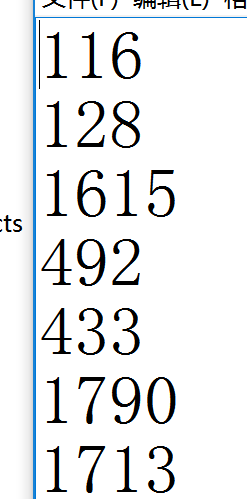

# 问题描述：
## 校准完成后打开游戏，互动沙盘内不显示内容，地面上显示内容，如下图所示。
<video controls>
    <source src="videos/MagicIsland-Calibration-1-1.mp4" type="video/mp4">
</video>
# 解决方法：
## 1. 退出游戏，将沙箱放置到投影仪下方正确位置后，重新校准，校准第一步注意不要将框画的超过沙盘范围，沿着沙盘边缘内侧画框即可，如视频所示，校准完成后重新打开游戏，查看问题是否解决，若问题仍然存在，则进行下一步。
<video controls>
    <source src="videos/MagicIsland-Calibration-1-2.mp4" type="video/mp4">
</video>
## 2. 下载校准教学视频（链接: https://pan.baidu.com/s/1skZe0Gl 密码: hqs4），认真观看视频，根据视频一步步正确校准后重新打开游戏，查看问题是否解决，若问题仍然存在，则进行下一步。
## 3. 打开C:\sandboxData\data文件夹，用记事本程序打开sandboxLayout.txt文件，查看第3行、第6行和第7行是否与图片中的数值差别较大（数值差超过200），将文件中对应的位置改成与图片中数值一样后后重新打开游戏，查看问题是否解决，若问题仍然存在，则进行下一步。

## 4. 联系客服，反馈遇到的问题。