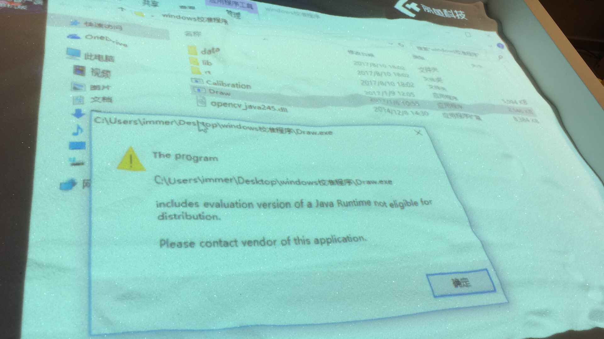

# 问题描述：
## 校准程序打开提示错误，无法正常打开运行，如下图所示。

# 解决方法：
## 1. 根据（链接: https://pan.baidu.com/s/1pLHNWfx 密码: r552 ）重新下载校准程序，在主机上解压缩后重新运行，查看问题是否解决，若问题仍然存在，则进行下一步。
## 2. 将系统时间更改为2017年4月1日，然后重新运行校准程序，查看问题是否解决，若问题仍然存在，则进行下一步。
## 4. 联系客服，反馈遇到的问题。