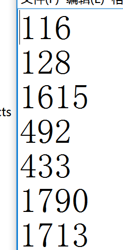

## 问题描述：
### 校准完成后打开游戏，游戏内容在地面上显示正常，在沙盘内显示不正常，如下图所示。
<video controls>
    <source src="videos/MagicIsland-Calibration-1-1.mp4" type="video/mp4">
</video>
## 解决方法：
### 1. 重新校准：退出游戏，将沙箱放置到投影仪下方正确位置后，重新校准一次。
> 注：校准第一步不要将框画的超过沙盘范围，沿着沙盘边缘内侧画框即可，如视频所示。
<video controls>
    <source src="videos/MagicIsland-Calibration-1-2.mp4" type="video/mp4">
</video>
### 2. 观看校准教学视频：若问题依然存在，下载校准教学视频（链接: https://pan.baidu.com/s/1skZe0Gl 密码: hqs4），认真观看学习，根据视频指导再重新校准一次。
### 3. 修改数据：若问题依然存在，打开C:\sandboxData\data文件夹，用记事本程序打开sandboxLayout.txt文件，查看第3行、第6行和第7行是否与图片中的数值差别较大（数值差超过200），将文件中对应的位置改成与图片中数值一样后保存。

### 4. 若仍然无法解决，请先通过无线网卡等设备将沙盘主机联网，然后联系客服通过远程控制进行进一步排查。