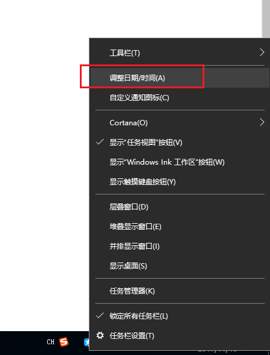
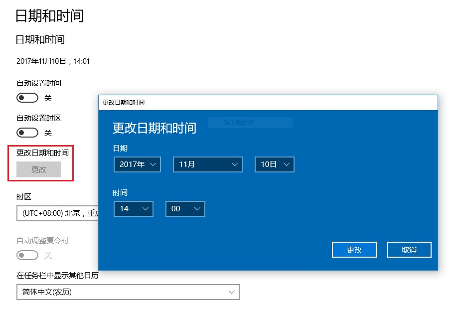

## 问题描述：
### 校准程序打开提示错误，无法正常打开运行，如下图所示。

## 解决方法：
### 更改系统时间：
#### 1）如下图所示，在桌面右下角的时间处单击鼠标右键，选择“调整日期/时间”。

#### 2）点击“更改”按键，将日期更改为2017年8月8日，然后重新运行校准程序。

#### 3）若仍然提示出错，按照同样的方法将日期更改为2017年4月8日，然后重新运行校准程序。