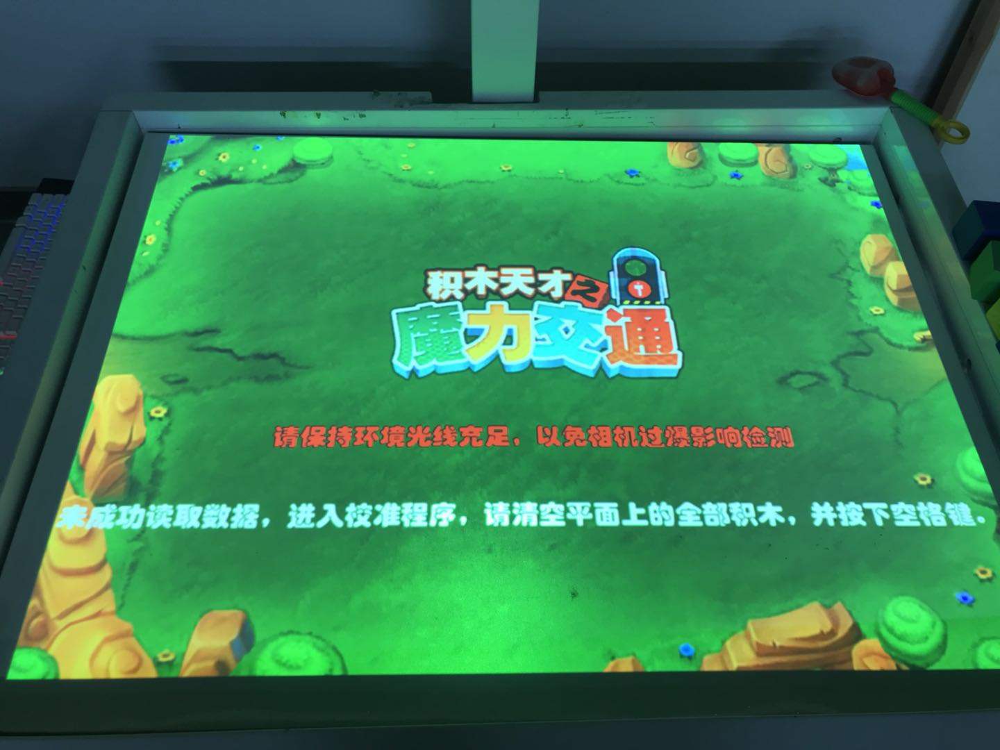
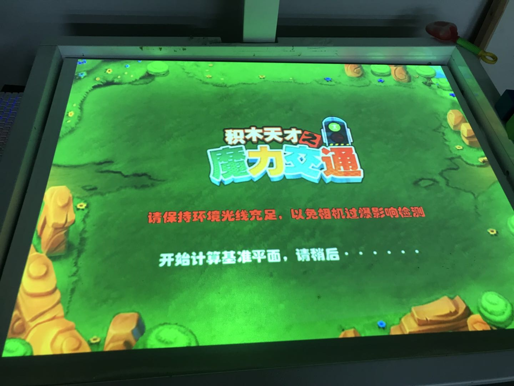
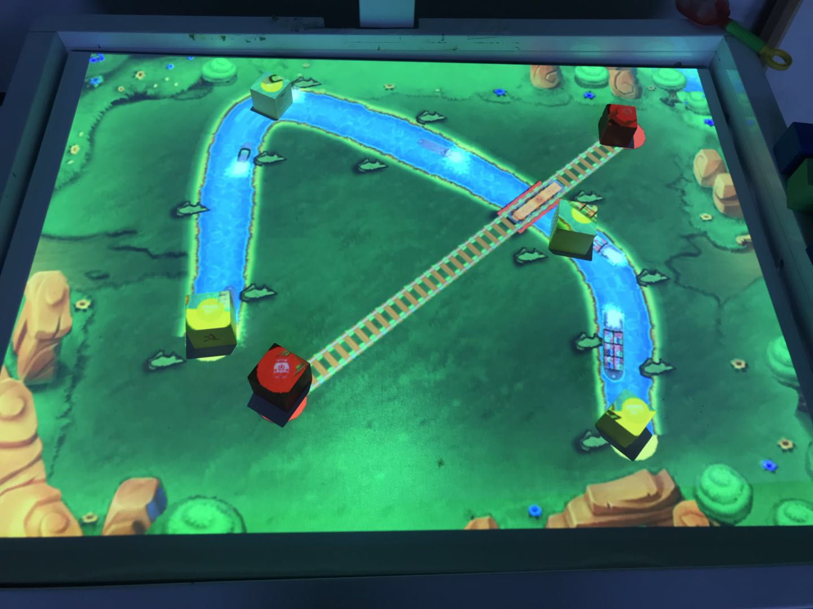

## 问题描述：
### 积木交通游戏打开后，无法正常运行游戏，放上积木后无法正确显示道路。

## 解决方法：
### 1. 首先确认沙盘已经进行过正确的校准，其他游戏如“沙滩乐园”等能够打开正常运行。
### 2. 重新进行积木交通游戏的校准：
#### 1）将沙盘内的沙子整理平整，然后在沙盘的沙面上铺上白色木板，白色木板上不要放置任何物体。
#### 2）在游戏客户端内重新选择积木交通游戏，在进入游戏后按键盘上的字母“c”键进入积木交通游戏的校准，如下图所示，画面下方会出现一行白色的提示语。

#### 2）按键盘上的空格键进入积木交通游戏的校准，如下图所示，画面下方会出现“开始计算基准平面”等字样。

#### 3）等待“开始计算基准平面”等字样消失后，将积木放置到白色木板上，观察游戏是否能够正常运行，如下图所示。

### 2. 若游戏还是无法正常运行，则打开部分室内灯光后重新进行以上步骤。
### 3. 若仍然无法解决，请先通过无线网卡等设备将沙盘主机联网，然后联系客服通过远程控制进行进一步排查。