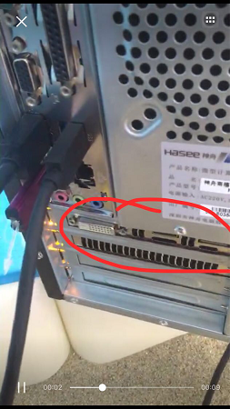

## 问题描述：
### 主机正常运行但是投影仪显示无信号。
## 解决方法：
### 1. 排查是否连接至正确的HDMI接口：检查主机后面板的HDMI连接线，查看是否连接至下图红圈中的HDMI接口。

### 2. 排查显卡插槽：关机后拔掉主机电源线，然后打开主机机箱盖，检查显卡是否从插槽中滑出，按压插紧后再开机。

### 3. 排查接口是否松动：检查投影仪和主机后面板的HDMI接口处连接是否松动，保证连接紧密。