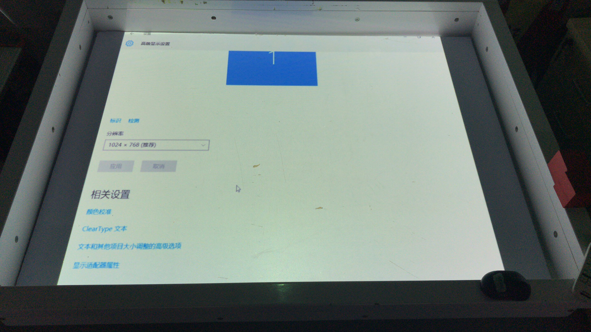

## 问题描述：
### 投影仪无法投满整个沙盘，如下图所示。

## 解决方法：
### 1. 正确设置分辨率和投影仪宽高比：将系统分辨率设置为1024*768，如上图所示；将投影仪宽高比设置为4:3。
### 2. 打开NVIDIA控制面板：在桌面上单击鼠标右键，选择“NVIDIA控制面板”，如下图所示。

### 3. 调整桌面大小：按照下面的视频调整桌面大小。
<video controls>
    <source src="videos/MagicIsland-Projector-4-1.mp4" type="video/mp4">
</video>
<video controls>
    <source src="videos/MagicIsland-Projector-4-2.mp4" type="video/mp4">
</video>