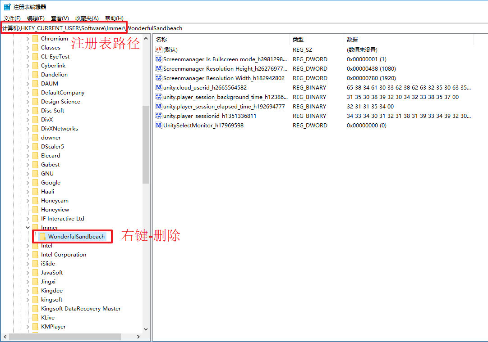

## 问题描述：
### 校准完成后打开游戏，地形固定向右下角偏一定距离，如下视频所示。
<video controls>
    <source src="videos/MagicIsland-Projector-5-1.mp4" type="video/mp4">
</video>
## 解决方法：
### 1. 正确设置分辨率和投影仪宽高比：将系统分辨率设置为1024*768；将投影仪宽高比设置为4:3。
### 2. 按windows徽标键+R键打开“运行”窗口，输入“regedit”后按回车键，打开注册表编辑器，如下图所示。

### 3. 如上图所示，根据注册表路径找到“Immer”文件夹，删除该文件夹下的所有文件夹。
### 4. 重新打开游戏，若地形仍然固定向右下角偏一定距离，则尝试重新校准后重复以上操作。
