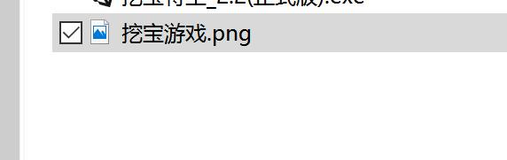
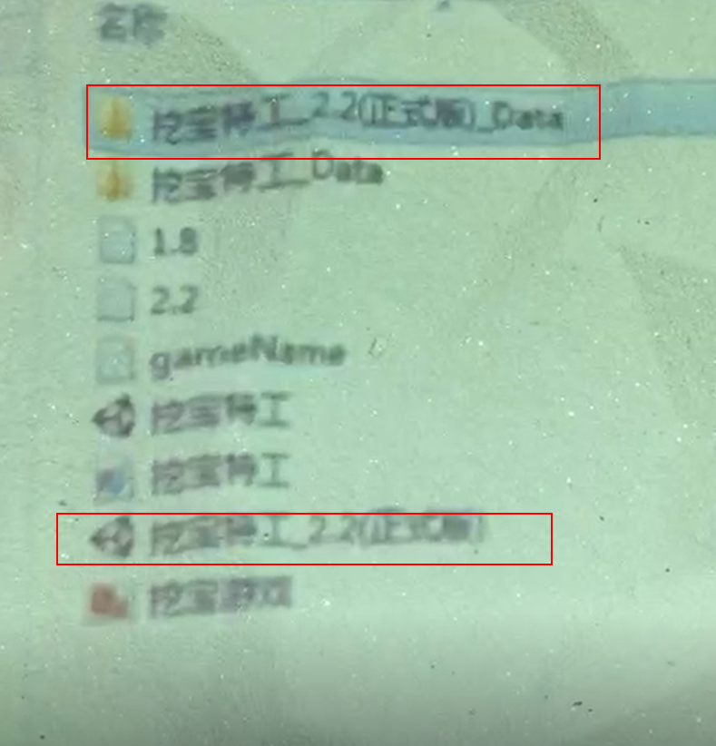

# 问题描述：
## 游戏更新后打开客户端，某款游戏的图片消失不存在，导致无法选择该游戏。
# 解决方法：
## 1. 退出魔幻岛客户端，打开文件夹C:\sandboxGame\game，将文件夹内的内容全部删除，然后重新将更新包内的游戏拷贝到该目录，如下图所示，重新启动魔幻岛客户端，查看问题是否解决，若问题仍然存在，则进行下一步。

## 2. 退出魔幻岛客户端，打开文件夹C:\sandboxGame\game，再打开客户端中不存在游戏对应的文件夹（如挖宝特工），查看文件夹内是否存在对应的图片，如下图所示，若不存在，则将游戏更新包内对应游戏文件夹内的图片文件拷贝到该文件夹，重新启动魔幻岛客户端，查看问题是否解决，若问题仍然存在，则进行下一步。

## 3. 退出魔幻岛客户端，打开文件夹C:\sandboxGame\game，再打开客户端中不存在游戏对应的文件夹（如挖宝特工），查看文件夹内是否有多个版本的游戏文件存在，如下图所示，若存在，则严格按照第一步重新执行一次，重新启动魔幻岛客户端，查看问题是否解决，若问题仍然存在，则进行下一步。

## 4. 联系丽鱼科技客服，反馈遇到的问题。