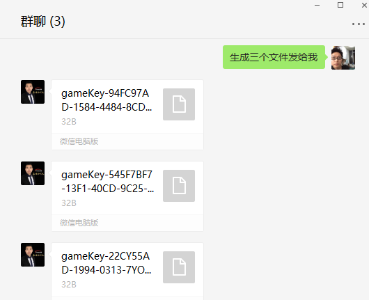

# 问题描述：
## 游戏如何更新？
# 解决方法：
## 1. 在[相关资源下载](https://imvr.github.io/ly/ "相关资源下载")  页面，下载对应自己魔幻岛互动沙盘版本的最新版游戏包。目前沙盘版本包括：魔幻岛AR互动沙盘一代无U盾版（采用kinect1代和license）、魔幻岛AR互动沙盘一代有U盾版（采用kinect1代和U盾）、魔幻岛AR互动沙盘二代和互动沙池通用版（采用kinect2代和U盾）三个版本，请对号入座，若无法确定自己拥有的魔幻岛互动沙盘版本，请联系客服。
## 2. 联系客服，支付新游戏授权费用，（按照授权时长收费，永久版售价999元人民币）。
### 注：魔幻岛AR互动沙盘一代无U盾版目前已停止“春夏秋冬”之后的新游戏更新，此版本沙盘客户需购买U盾一个，升级为魔幻岛AR互动沙盘一代有U盾版后才能更新“春夏秋冬”之后开发的新游戏。
## 3. 打开文件夹C:\sandboxGame\game，将文件夹内的内容全部删除，然后将更新包内的游戏拷贝到该目录，如下图所示。

## 4. 无U盾版互动沙盘游戏更新方法（免费更新春夏秋冬）：
### 1) [点击我](/attachment/sandbox/keyGenerator.zip "魔幻岛AR互动沙盘一代无U盾版机器码生成工具") 下载“魔幻岛AR互动沙盘一代无U盾版机器码生成工具”，解压缩得到ImmerKeyGenerate.exe文件，拷贝到沙盘主机的C:\sandboxGame\game下每个游戏文件夹内并双击运行，将生成的以“gameKey”开头的文件发送给客服，然后删除每个游戏文件夹内的ImmerKeyGenerate.exe文件，如下图所示。

### 2) 等待客服将激活文件发回，接收激活文件并拷贝到c:\sandboxData\license目录下，替换原有文件，如下图所示。

### 3) 打开桌面上的魔幻岛客户端程序，查看游戏是否能够正常运行。
## 5. 有U盾版互动沙盘游戏更新方法：
### 1) [点击我](/attachment/sandbox/dongleUpdate_v1.0.0.4.zip "魔幻岛AR互动沙盘一代、二代和互动沙池有U盾版远程升级工具")下载“魔幻岛AR互动沙盘一代、二代和互动沙池有U盾版远程升级工具”，把主机上的U盾拔下来插到下载好远程升级工具的已联网电脑上，解压缩下载好的压缩包后双击运行ImmerDongleUpdate.exe文件，等待弹出的黑色窗口运行完毕，拍照留存后，关闭黑色窗口，U盾升级完成。
### 2) 将U盾插回到主机上，打开桌面上的魔幻岛客户端程序，查看游戏是否能够正常运行。
## 6. 若更新失败，请及时联系客服，反馈遇到的问题。