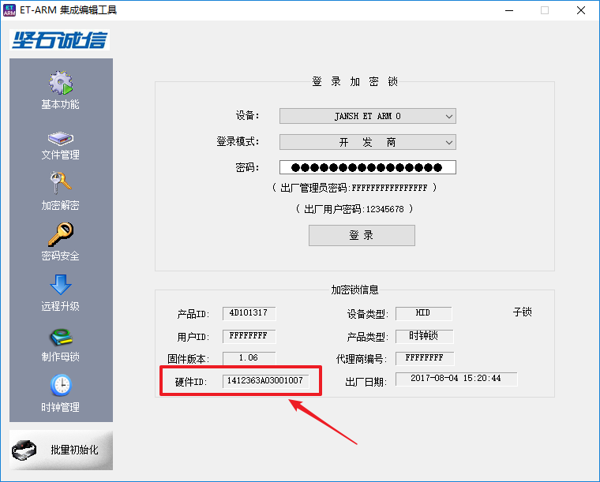

## 问题描述：
### 沙盘一代游戏更新教程。
## 解决方法：
### 1. 最新版游戏包下载：[点击我](https://imvr.github.io/ly/ "资源下载")，在打开的页面中下滑到最下方，找到“资源下载”部分，下载对应自己魔幻岛互动沙盘版本的最新版游戏包。
> 注：目前沙盘一代有两个版本：无U盾版（完整版包含三个游戏，后续停止更新）和有U盾版（完整版包含四个游戏，后续停止更新）。若无法确定自己的沙盘版本，请联系客服。
### 2. 支付费用：联系客服，支付更新新游戏的授权费用。
### 3. 游戏更新：打开沙盘主机上的文件夹C:\sandboxGame\game，将文件夹内的内容全部删除，然后将更新包内的所有游戏拷贝到该目录，如下图所示。

### 4. 游戏激活：
### --------沙盘一代无U盾版--------
#### 1）验证文件生成工具下载：[点击我](/attachment/sandbox/keyGenerator.zip "魔幻岛AR互动沙盘一代无U盾版验证文件生成工具") ，下载“魔幻岛AR互动沙盘一代无U盾版验证文件生成工具”，解压缩后得到ImmerKeyGenerate.exe文件，拷贝到沙盘主机的C:\sandboxGame\game下每个游戏文件夹内并双击运行，将生成的以“gameKey”开头的验证文件发送给客服，如下图所示。

#### 2）激活文件替换：等待客服将激活文件发回，接收激活文件并拷贝到c:\sandboxData\license目录下，替换原有文件，如下图所示。

#### 3) 打开桌面上的魔幻岛客户端程序，查看游戏是否能够正常运行。
### --------沙盘一代有U盾版--------
#### 1）U盾远程升级工具下载：[点击我](/attachment/sandbox/dongleUpdate_v1.0.0.5.zip "魔幻岛AR互动沙盘U盾远程升级工具")，下载“U盾远程升级工具”，拷贝到沙盘电脑上并解压缩。
#### 2）U盾ID读取工具下载：[点击我](/attachment/sandbox/ETARMTool.exe "U盾ID读取工具")下载U盾ID读取工具，拷贝到沙盘电脑上打开后，将软件界面左下角的U盾ID（如下图所示）拍照发给客服。

#### 3）升级U盾：待客服告知可以远程升级后，双击运行U盾远程升级工具解压缩后得到的ImmerDongleUpdate.exe文件，等待弹出的黑色窗口运行完毕，拍照留存，关闭黑色窗口，U盾升级完成。
#### 4）打开桌面上的魔幻岛客户端程序，查看游戏是否能够正常运行。