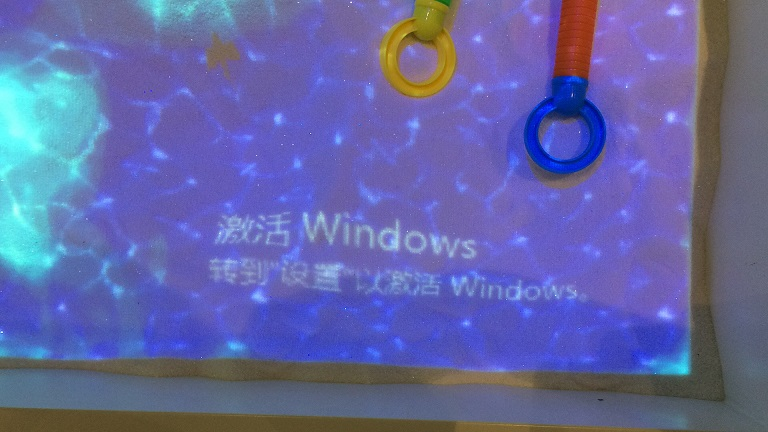
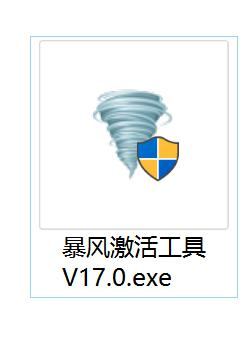
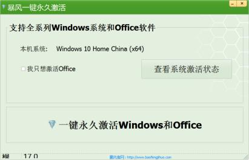

# 问题描述：
## 桌面右下角显示需要激活Windows，如下图所示，如何激活Windows系统？

# 解决方法：
## 1. 打开“C:\安装调试工具”文件夹（文件夹名字可能不同，可打开中文名称的文件夹逐一查找），找到“暴风激活工具V17.0.exe”，如下图所示。

## 2. 若没有找到“暴风激活工具V17.0.exe”，可[点击我](/attachment/sandbox/暴风激活工具V17.0.exe "AR魔幻岛2代主机Windows10系统激活程序")下载“AR魔幻岛2代主机Windows10系统激活程序”后进行下一步操作。
## 3. 在沙盘主机上双击运行“暴风激活工具V17.0.exe”，若弹出提示“你要允许来自未知发布者的此应用对你的设备进行更改吗？”，选择“是”，进入如下界面。

## 4. 点击“一键永久激活Windows和Office”即可。
## 5. 若激活失败，请及时联系客服，反馈遇到的问题。